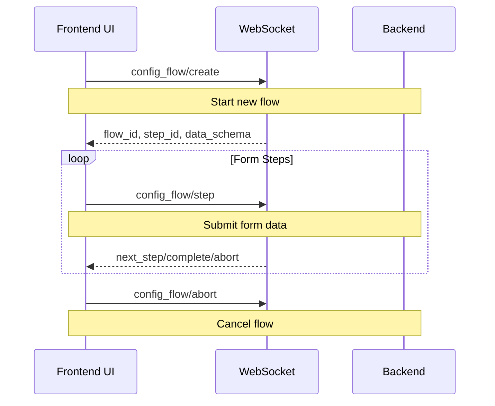

# Integration Setup Flow Analysis (Frontend Perspective)

## 1. Entry Points

### Frontend Entry Points

1. **Integration Dialog**

   - File: `src/panels/config/integrations/dialog-add-integration.ts`
   - Class: `AddIntegrationDialog`
   - Method: `_handleIntegrationPicked`
   - Purpose: Entry point for adding new integrations

2. **Config Flow Dialog**
   - File: `src/dialogs/config-flow/show-dialog-data-entry-flow.ts`
   - Function: `showConfigFlowDialog`
   - Purpose: Manages the configuration wizard UI

## 2. Strategy Design Overview

The frontend integration setup flow provides:

- **Unified Configuration Interface**: Standardized way to configure any integration
- **Progressive Disclosure**: Step-by-step configuration process
- **State Management**: Tracks configuration progress
- **Error Handling**: User-friendly error presentation
- **Real-time Updates**: WebSocket-based state synchronization

## 3. High-Level Flow Overview

### Frontend Components

1. **Dialog System**

   - `showConfigFlowDialog`: Entry point for config flow
   - `step-flow-form.ts`: Handles form steps
   - `step-flow-create-entry.ts`: Handles final step

2. **WebSocket Interface**

   - `home-assistant-js-websocket`: Client library
   - Message types:
     ```typescript
     interface ConfigFlowMessage {
       type: "config_flow/create" | "config_flow/step" | "config_flow/abort";
       flow_id?: string;
       handler?: string;
       step_id?: string;
       data?: Record<string, any>;
     }
     ```

3. **State Management**
   - Flow progress tracking
   - Form state management
   - Error state handling

### Key Frontend Decisions

1. **Integration Type Handling**

   ```typescript
   if (integration.supported_by) {
     // Handle supported integrations
   } else if (integration.config_flow) {
     // Handle config flow integrations
   } else {
     // Handle YAML-based integrations
   }
   ```

2. **Form Step Processing**

   ```typescript
   // Form submission
   const result = await this.hass.callWS<DataEntryFlowStep>({
     type: "config_flow/step",
     flow_id: this.flow.flow_id,
     step_id: this.flow.step_id,
     data: formData,
   });
   ```

3. **Error Handling**
   ```typescript
   if (result.type === "abort") {
     showAlertDialog(this, {
       text: result.reason,
       warning: true,
     });
   }
   ```

## 4. Special Notes & Comments

### Frontend-Specific Comments

```typescript
// USERNOTE: Form validation happens both client and server side
// Context: step-flow-form.ts
// Impact: Need to maintain consistent validation rules

// USERQ: Should we cache integration manifests?
// Context: Integration loading in dialog-add-integration.ts
// Impact: Could improve performance for frequently used integrations

// LLM: The frontend uses a state machine pattern to manage form steps
// Context: show-dialog-data-entry-flow.ts
// Impact: Simplifies step navigation and state management
```

## 5. Frontend Entities

### Core Components

1. **ConfigFlowDialog**

   - Files: `src/dialogs/config-flow/show-dialog-data-entry-flow.ts`
   - Purpose: Manages the configuration wizard UI
   - Key Methods:
     ```typescript
     showConfigFlowDialog(
       element: HTMLElement,
       dialogParams: {
         startFlowHandler?: string;
         continueFlowId?: string;
         showAdvanced?: boolean;
         manifest?: IntegrationManifest;
       }
     )
     ```

2. **DataEntryFlowProgress**

   - Files: `src/data/data_entry_flow.ts`
   - Purpose: Tracks flow progress
   - Interface:
     ```typescript
     interface DataEntryFlowProgress {
       flow_id: string;
       handler: string;
       step_id: string;
       context: Record<string, any>;
       data_schema?: HaFormSchema[];
       errors?: Record<string, string>;
     }
     ```

3. **Form Components**
   - Files: `src/components/ha-form/`
   - Purpose: Dynamic form generation
   - Features:
     - Schema-based form generation
     - Validation
     - Error display

## 6. Frontend-Backend Interface

### WebSocket Messages



### Message Types

1. **Flow Creation**

   ```typescript
   interface CreateFlowMessage {
     type: "config_flow/create";
     handler: string;
   }
   ```

2. **Step Submission**

   ```typescript
   interface StepMessage {
     type: "config_flow/step";
     flow_id: string;
     step_id: string;
     data: Record<string, any>;
   }
   ```

3. **Flow Abort**
   ```typescript
   interface AbortMessage {
     type: "config_flow/abort";
     flow_id: string;
   }
   ```

## 7. Navigation & Diving In

### Key Frontend Files

1. **Dialog System**

   - [Config Flow Dialog](../src/dialogs/config-flow/show-dialog-data-entry-flow.ts)
   - [Form Step Handling](../src/dialogs/config-flow/step-flow-form.ts)
   - [Create Entry Step](../src/dialogs/config-flow/step-flow-create-entry.ts)

2. **Data Handling**

   - [Config Flow Data](../src/data/config_flow.ts)
   - [Data Entry Flow](../src/data/data_entry_flow.ts)

3. **UI Components**
   - [Form Component](../src/components/ha-form/)
   - [Integration Dialog](../src/panels/config/integrations/dialog-add-integration.ts)

### Next Steps

1. **Frontend Implementation**

   - Study form validation patterns
   - Review error handling strategies
   - Analyze state management approaches

2. **UI/UX Considerations**

   - Review accessibility features
   - Study responsive design patterns
   - Analyze user feedback mechanisms

3. **Performance Optimization**
   - Review caching strategies
   - Study lazy loading patterns
   - Analyze WebSocket optimization

## Integration Types and Handling

The frontend handles several distinct types of integrations, each with its own setup flow and requirements:

### 1. Protocol Integrations

- **Examples**: Z-Wave, Zigbee, Thread
- **Characteristics**:
  - Hardware-based protocols
  - Require specific hardware adapters
  - Support device discovery
- **Setup Flow**:
  - Special handling in `protocolIntegrationPicked`
  - Device discovery process
  - Hardware-specific configuration

### 2. Brand Integrations

- **Examples**: Apple, Google, Amazon
- **Characteristics**:
  - Collections of related integrations
  - May include multiple domains
  - Often support IoT standards
- **Setup Flow**:
  - Shows sub-integrations
  - Handles multiple domains
  - Special cases (e.g., HomeKit devices)

### 3. Config Flow Integrations

- **Characteristics**:
  - User-friendly setup process
  - Step-by-step configuration
  - Form-based input
- **Setup Flow**:
  - Uses `_createFlow` method
  - Handles form submissions
  - Manages flow state

### 4. Helper Integrations

- **Purpose**: Create helper entities
- **Setup Flow**:
  - Direct navigation to helper creation
  - Form-based configuration
  - Entity creation

### 5. Cloud Integrations

- **Examples**: Home Assistant Cloud, Voice Assistants
- **Characteristics**:
  - Cloud-based services
  - External authentication
  - Remote access
- **Setup Flow**:
  - Special handling for cloud services
  - Voice assistant specific flows

### 6. YAML-based Integrations

- **Characteristics**:
  - No config flow
  - Manual configuration
  - Manifest-based
- **Setup Flow**:
  - Shows YAML configuration dialog
  - Manual setup instructions

### 7. Single Config Entry Integrations

- **Characteristics**:
  - Only one instance allowed
  - Prevents duplicate setup
- **Setup Flow**:
  - Checks for existing entries
  - Shows warning if already configured

### 8. IoT Standard Integrations

- **Characteristics**:
  - Follow specific IoT protocols
  - Standardized communication
- **Setup Flow**:
  - Protocol-specific handling
  - Standard-based configuration

### 9. Supported Integrations

- **Characteristics**:
  - Depend on other integrations
  - Share configuration
- **Setup Flow**:
  - Checks for required integrations
  - Uses parent integration's config

## WebSocket Subscriptions and Real-time Updates

### 1. Connection Management

The frontend maintains a persistent WebSocket connection to the Home Assistant backend for real-time updates:

```typescript
// Core connection management in connection-mixin.ts
protected hassConnected() {
  const conn = this.hass!.connection;
  broadcastConnectionStatus("connected");

  // Connection event handlers
  conn.addEventListener("ready", () => this.hassReconnected());
  conn.addEventListener("disconnected", () => this.hassDisconnected());
  conn.addEventListener("reconnect-error", (_conn, err) => {
    if (err === ERR_INVALID_AUTH) {
      broadcastConnectionStatus("auth-invalid");
      location.reload();
    }
  });
}
```

### 2. Core Subscriptions

The frontend subscribes to various data streams:

1. **Entity States**

   ```typescript
   subscribeEntities(conn, (states) => this._updateHass({ states }));
   ```

   - Purpose: Track entity state changes
   - Role: Keep UI in sync with backend state
   - Impact: Real-time updates for all entities

2. **Entity Registry**

   ```typescript
   subscribeEntityRegistryDisplay(conn, (entityReg) => {
     // Process entity metadata
     this._updateHass({ entities });
   });
   ```

   - Purpose: Track entity metadata changes
   - Role: Update entity display information
   - Impact: UI updates for entity properties

3. **Device Registry**

   ```typescript
   subscribeDeviceRegistry(conn, (deviceReg) => {
     // Process device information
     this._updateHass({ devices });
   });
   ```

   - Purpose: Track device information
   - Role: Update device relationships
   - Impact: Device management UI updates

4. **Configuration**
   ```typescript
   subscribeConfig(conn, (config) => this._updateHass({ config }));
   ```
   - Purpose: Track configuration changes
   - Role: Update UI based on config
   - Impact: System-wide configuration updates

### 3. Health Monitoring

The connection is actively monitored:

```typescript
// Connection health check
this.__backendPingInterval = setInterval(() => {
  if (this.hass?.connected) {
    promiseTimeout(15000, this.hass?.connection.ping()).catch(() => {
      if (!this.hass?.connected) return;
      this.hass?.connection.reconnect(true);
    });
  }
}, 30000);
```

- **Purpose**: Ensure connection stability
- **Role**: Detect and recover from connection issues
- **Impact**: Maintains real-time updates

### 4. Integration-specific Subscriptions

Integrations can establish their own subscriptions:

```typescript
// Example: Z-Wave JS subscription
subscribeZwaveNodeStatus(
  hass: HomeAssistant,
  device_id: string,
  callback: (message: ZWaveJSNodeStatusUpdatedMessage) => void
)
```

- **Purpose**: Track integration-specific events
- **Role**: Update integration-specific UI
- **Impact**: Real-time updates for integration features

### 5. Subscription Lifecycle

1. **Establishment**

   - Created during component initialization
   - Managed by connection-mixin
   - Automatically reconnected on disconnection

2. **Cleanup**

   - Unsubscribe functions returned for cleanup
   - Called during component disconnection
   - Prevents memory leaks

3. **Error Handling**
   - Automatic reconnection attempts
   - Error state propagation
   - User notification for critical errors

### 6. Performance Considerations

1. **Connection Management**

   - Single WebSocket connection
   - Efficient message batching
   - Automatic reconnection

2. **Data Processing**

   - Memoization of processed data
   - Efficient state updates
   - Batched UI updates

3. **Resource Usage**
   - Subscription cleanup
   - Memory management
   - Connection pooling
